# Beginner Blueprint Tips

Tips to make life easier when using blueprints

- [Beginner Blueprint Tips](#beginner-blueprint-tips)
  - [1. Fast Create Branch Node](#1-fast-create-branch-node)
  - [2. Fast Create Sequence Node](#2-fast-create-sequence-node)
  - [3. Fast Create Delay Node](#3-fast-create-delay-node)
  - [4. Fast Create Setter & Getter](#4-fast-create-setter--getter)
  - [5. Hide unconnected pins](#5-hide-unconnected-pins)
  - [6. Drag Assign Category](#6-drag-assign-category)
  - [7. Transfer pins](#7-transfer-pins)
  - [8. Replace variable for another one](#8-replace-variable-for-another-one)
  - [9. Convert to Validated Get](#9-convert-to-validated-get)
  - [10. Change to Pure Cast](#10-change-to-pure-cast)
  - [11. Call same function on multiple objects](#11-call-same-function-on-multiple-objects)
  - [12. Call same function on multiple objects in an array](#12-call-same-function-on-multiple-objects-in-an-array)
  - [13. Create Input Parameter in function by draggin a pin](#13-create-input-parameter-in-function-by-draggin-a-pin)
  - [14. Create Output Parameter in function by draggin a pin](#14-create-output-parameter-in-function-by-draggin-a-pin)
  - [15. Multiple return nodes](#15-multiple-return-nodes)

## 1. Fast Create Branch Node
    
Hold **B** and **left click** on the graph

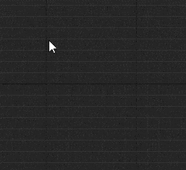

## 2. Fast Create Sequence Node

Hold **S** and **left click** on the graph

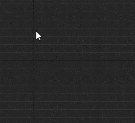

## 3. Fast Create Delay Node

Hold **D** and **left click** on the graph

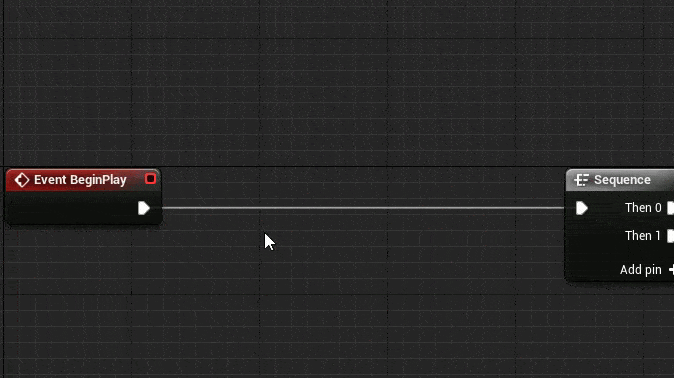

## 4. Fast Create Setter & Getter

- **Fast Create Getter:** Hold **Control** nad **drag** the variable to the graph
- **Fast Create Setter:** Hold **Alt** and **drag** the variable to the graph

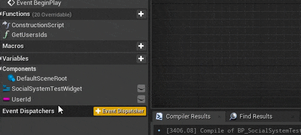

## 5. Hide unconnected pins

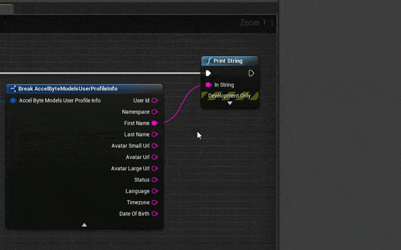

## 6. Drag Assign Category

The Category of a variable, función, etc. can be assigned by dragging it to an existing category

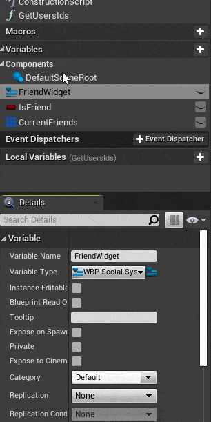

## 7. Transfer pins 

Hold **Control** to move the pins in group from one node to another.

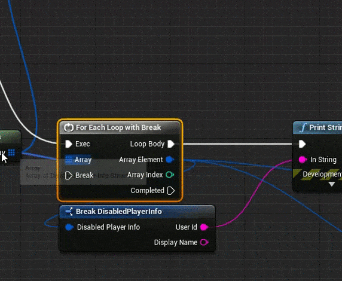

## 8. Replace variable for another one

A variable can be replaced for another of the same type by using the conextual menu

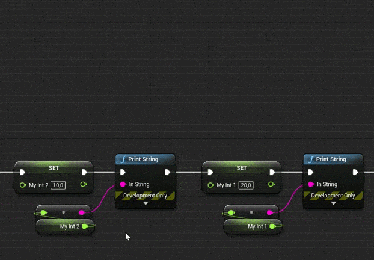

## 9. Convert to Validated Get

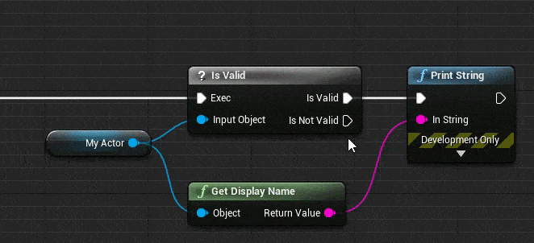

## 10. Change to Pure Cast

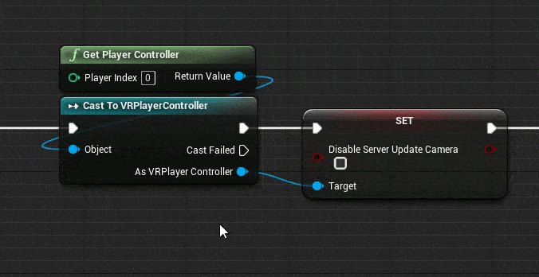

## 11. Call same function on multiple objects

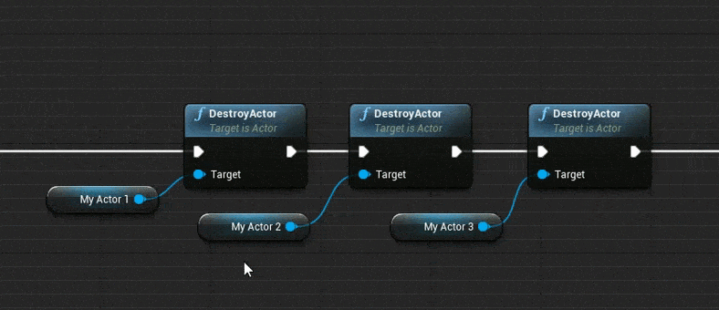

## 12. Call same function on multiple objects in an array

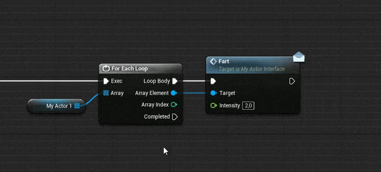

## 13. Create Input Parameter in function by draggin a pin

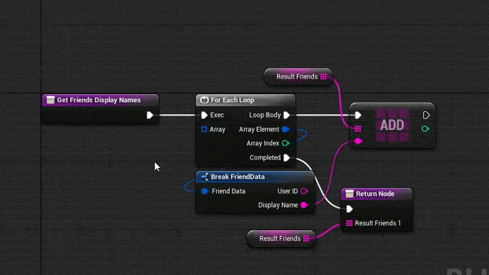

## 14. Create Output Parameter in function by draggin a pin

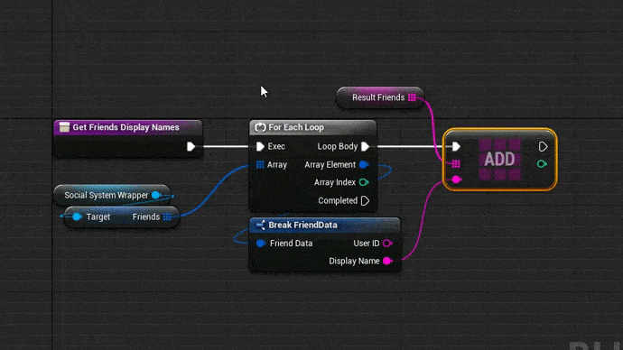

## 15. Multiple return nodes

It's possible to have more than one return node inside a function. Extra return nodes can be created by copying and pasting an existing return node. (Use **Ctrl-W** to fast copy & paste node)

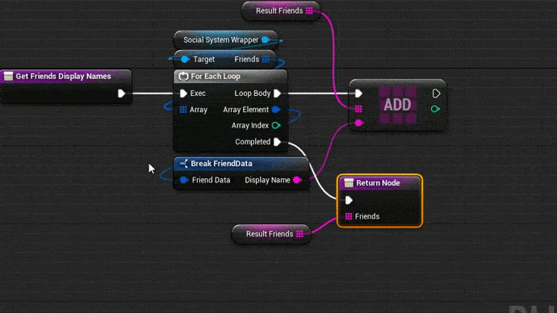
